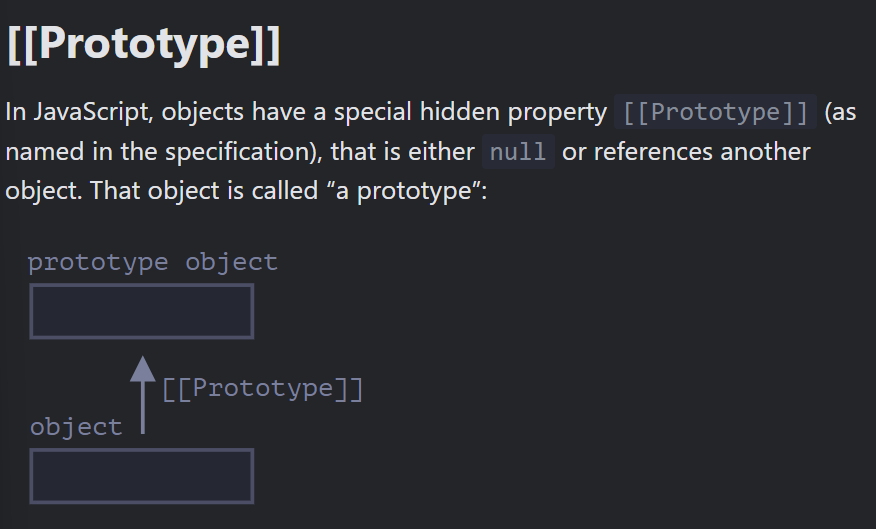
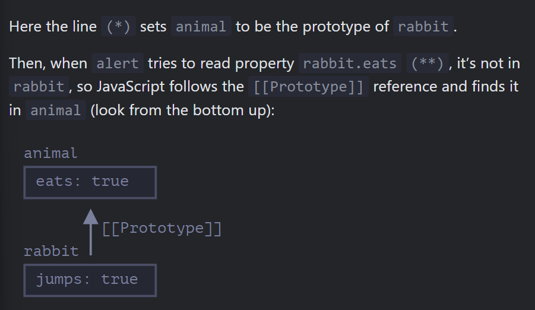
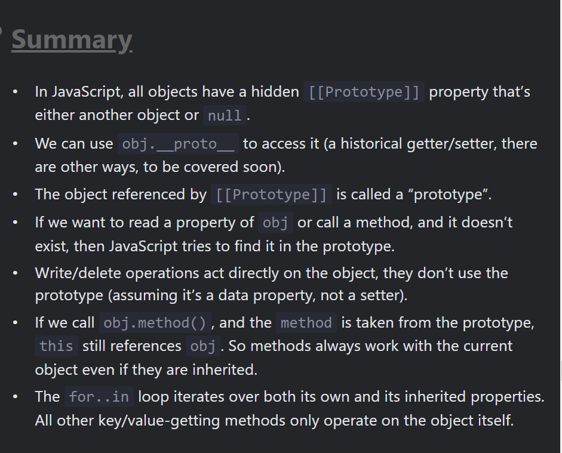

## 15 September 2024 - revision on 22 October

## Objects are usually created to represent entities of the real world, like users, orders and so on:

``` js
let user = {
  name : "John",
  age : 30
};

user.sayHi = function() {
  console.log("Hello!");
};

// user.sayHi(); // Hello!

let user1 = {
  // ...
};

function sayHi() {
  console.log("Hello!");
}

user1.sayHi = sayHi;

 user1.sayHi(); // Hello!
```

# Method shorthand

## these objects do the same
```js
let user2 = {
  sayHi: function() {
    console.log('Hello');
  }
};

## method shorthand looks better, right?
user2 = {
  sayHi() { // same as "sayHi: function(){...}"
    console.log("Hello");
  }
};
```
# *this* in Methods

## To access the object, a method can use the this keyword.
```js
let user = {
  name: "John",
  age: 30,

  sayHi() {
    // "this" is the "current object"
    console.log(this.name);
    console.log(user.name); // "user" instead of "this"
  }

};

user.sayHi(); // John

-----------------------
let user = {
  name: "John",
  age: 30,

  sayHi() {
    console.log(user.name); // "user" instead of "this"
  }

};
// e.g. admin = user and overwrite user with something else, then it will access the wrong object.

let admin = user;
user = null; // overwrite to make things obvious 

admin.sayHi(); // TypeError: Cannot read property "name" of null
```
## "this" is not bound
```js
function sayHi(){
  console.log(this.name );
}
// It can be used in any function, even if it’s not a method of an object.

let user = { name: "John"};
let admin = { name: "Admin"};

function sayHi() {
  console.log( this.name );
}

// use the same function in two objects
user.f = sayHi;
admin.f = sayHi;

// these calls have different this
// "this" inside the function is the object "before the dot"
user.f(); // John (this == user)
admin.f(); // Admin (this == admin)

admin['f'](); // Admin (dot or square brackets access the method - doesn't matter)
```
## Calling without an object: this == undefined
```js
function sayHi() {
  console.log(this);
}

sayHi(); // undefined
```
## Arrow functions have no “this”
```js
// For instance, here arrow() uses this from the outer user.sayHi() method:

let user = {
  firstName: "Ilya",
  sayHi() {
    let arrow = () => this.firstName;
    return arrow();
  }
}

user.sayHi(); // Ilya
```
# Summary
- ```Functions that are stored in object properties are called "methods".```

- ```Methods allow objects to "act" like *object.doSomething()*.```

- ```Methods can reference the object as *this*.```
## The value of this is defined at run-time.
- ```When a function is declared, it may use this, but that this has no value until the function is called.```

- ```A function can be copied between objects..```

- ```When a function is called in the “method” syntax: object.method(), the value of this during the call is object.```
```js
function makeUser() {
  return {
    name: "John",
    ref() {
      return this;
    }
  };
}

let user = makeUser();

alert( user.ref().name ); // John

---------------

let ladder = {
  step: 0,
  up(){
    this.step++;
  },
  down() {
    this.step--;
  },
  showStep:function() { // show the current step
    consle.log(this.step);
  }
};

ladder.up();
ladder.up();
ladder.down();
ladder.showStep();
ladder.down();
ladder.showStep();
ladder.up().up().down().showStep().down().showStep();
```






# `Summary of PrototypesInheritance.js` 

