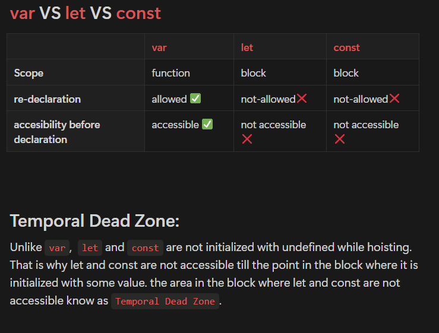

# setTimeout() 
## The global `setTimeout()` method sets a timer that executes a function or specified piece of code once the timer expires. 
## The returned `timeoutId` is a positive integer value that identifies the timer created by the call to `setTimeout()`. This value can be passed to `clearTimeout()` to cancel the timeout.
```js
// Syntax: 
let id = setTimeout(function,delay);

// to clear the timeout
clearTimeout(id);
```
# `setInterval()`
## The `setInterval()` method, offered on the `Window` and `Worker` interfaces, repeatedly calls a function or executes a code snippet, with a fixed time delay between each call.
## This method returns an interval ID that uniquely identifies the interval, so you can remove it later by calling `clearInterval()`.
```js
let id = setInterval(function, delay);

// to clear the time interval
clearInterval(id);
```
# Bloking Code VS Non-Blocking Code
## As JS is `synchronous` language, it executes code line by line. So if there is a block of code that will take some time, in that case, it will block the execution of the rest of the part till that duration.
```js
console.log("hi");
for(let i=0;i<70000000;i++){
    // doing something
}
console.log("Welcome to masai School.")
// In this code console of "Welcome to masai School." is executed only after the completion of the loop.
```
1. But this kind of behavior is not always good for user experience.

2. To overcome this issue JS takes the help of `browser API` to execute tasks (that might take some time ) asynchronously.
```js
console.log("Hi");
setTimeout(function(){
    for(let i=0;i<7000000000;i++){
    // doing something    
    }
},0)
console.log("Welcome to masai School.");
```
1. Once JS encounters any `asynchronous` code it gives it to the `browser API` and it is registered along with a callback function to be executed when the task completes.

2. When the timer is over, the code is moved to the callback queue or microtask queue based on the priority of that task.
## `Microtask Queue:`
- Holds microtasks, such as Promise callbacks and Mutation Observer callbacks. These tasks have higher priority than regular tasks and are executed before regular tasks.
## `Callback Queue:`
-  Holds tasks like timers, network responses, and user interaction events. These tasks are executed after microtasks.
# Event loop:
### The event loop is a continuous loop that repeatedly checks the state of different queues and the call stack. It follows a specific sequence:
1. `Check the Microtask Queue:` Execute all pending microtasks in the order they were added.
2. `Check the Callback Queue:` If the call stack is empty, move a task from the callback queue to the call stack and execute it.
3. `Repeat:` The event loop keeps cycling through these steps, allowing asynchronous tasks to be executed while maintaining responsiveness.
  
### Guess the output
```js
console.log("sync 1");
console.log("sync 2");
Promise.resolve().then(() =>{console.log("promise resolve 1")});

Promise.resolve().then(()=>{
    console.log("promise resolve 2");
    setTimeout(()=>{console.log("Inside timeout")},0);
});

Promise.resolve().then(()=>{console.log("promise resolve 3")});

setTimeout(
    ()=>{
    console.log("set Timeout 1");
    setTimeout(()=>{console.log("inside timeout")},1000);
    }
,2000);

setTimeout(()=>{console.log("set time out 2")},1000);
setTimeout(()=>{console.log("set time out 3")},0);

console.log("sync 3");
console.log("sync 4");
```
```js
console.log("sync 1");
console.log("sync 2");
Promise.resolve().then(()=>{console.log("promise resolve1")})
Promise.resolve().then(()=>{
    console.log("promise resolve 2");
    setTimeout(()=>{console.log("Inside Timeout")},0);
})
Promise.resolve().then(()=>{console.log("promise resolve 3")});
setTimeout(()=>{
    console.log("set Timeout 1");
    setTimeout(()=>{console.log("inside timeout")},0);
},0);
setTimeout(()=>{console.log("set time out 2")},0);
setTimeout(()=>{console.log("set time out 3")},0);

console.log("sync 3");
console.log("sync 4");

```

```js
console.log("sync 1")
console.log("sync 2")

setTimeout(()=>{console.log("set time out 1")},0);

setTimeout(()=>{
    console.log("set Timeout 2");
    Promise.resolve().then(()=>{console.log("inside promise resolve 1")});
},0);

setTimeout(()=>{console.log("set time out 3")},0);

Promise.resolve().then(()=>{console.log("promise resolve 1")});

Promise.resolve().then(()=>{
    console.log("promise resolve 2");
    setTimeout(()=>{console.log("Inside timeout 1")},0);
});

Promise.resolve().then(()=>{console.log("promise resolve 3")});

console.log("sync 3")
console.log("sync 4")
```
# `Hoisting`:
## In the compilation/ parsing phase (phase-1), We have all the tokens/identifiers available before the execution phase starts. Of course, the assignment happens in the execution phase, but yes, all the variables are available to us, they exist in the memory, immediately after the parsing phase (phase-1)

### `let`s and `const`s hoist to a block, whereas `var`s hoist to a function. 
###  In case of `var`, in the compilation/parsing phase, it is initialized to `undefined`.
### In case of `let`, in the compilation/parsing phase, a token is created, but it is not initialized at all (TDZ error - uninitialized)



# `JS Execution context`
## How JS executes code:

## Stack:
### Stack is an abstract data structure that follows LIFO (last in first out) principle; that means if we want to remove one element, the lastly added element will be removed first.


# ` JavaScript Execution of Synchronous Code`
## Execution Phases
## 1. Creation/Memory Phase:
1. During this phase, Javascript sets up the environment for code execution.
2. Variables and functions are `hoisted` - memory space is allocated for them.
3. Variable and function declarations are moved to the top of their respective scopes.
4. The global object is created, and `this` is determined in the global context.
## 2. Execution Phase: 
1. In this phase, the code is actually executed.
2. Execution starts from the top of the script or the function and proceeds line by line.
3. Variables are assigned values, functions are called, and expressions are evaluated.
## 3. Execution Stack
1. JavaScript uses a data structure known as the `call stack` to manage the execution of code.
2. It keeps track of the order in which functions are called and their respective execution contexts.

## 4.Global Execution Context`:
1. The global execution context is the top-level context for your code.
2. It represents the environment in which your entire script is executed.
3. It includes the global object (e.g., `window` in a web browser), and `this` refers to it.
4. Variables and functions declared in the global scope are accessible globally.

## 5. Function Execution Context
1. When a function is invoked, a new execution context is created for that function.
2. This execution context includes its own set of variables and a reference to the outer (enclosing) execution context.
3. The function's parameters and local variables are stored within this context.
4. When the function returns, its execution context is popped off the call stack.

## 6. Execution Context Creation:
1. Creation Phase:
- The function's parameters and variables are allocated memory.
- Variables are hoisted within the function's scope.
2. Execution Phase:
- The function's code is executed.

## 7. Call Stack:
1. As functions are called, their execution contexts are pushed onto the call stack.
2. The function at the top of the stack is the one currrently being executed. 
3. When a function completes, its context is removed from the stack, and control returns to the calling function.
```js
// JavascriptCopy code
var globalVar = "I am global;"

function exampleFunction() {
    var localVar = "I am local";
    console.log(globalVar);
}
exampleFunction();
```
## Global Execution Context:
- `globalVar` is declared in the global context.
- `exampleFunction` is declared in the global context.
- Execution starts with calling `exampleFunction()`.
## Function Execution Context for `exampleFunction`:
- `localVar` is declared within this context.
- The `console.log(globalVar)` statement is executed.
## Call Stack:
- Initially, the global execution context is on the stack.
- When `exampleFunction()` is called, its execution context is pushed onto the stack.
- After `exampleFunction()` completes, its execution context is popped off the stack.