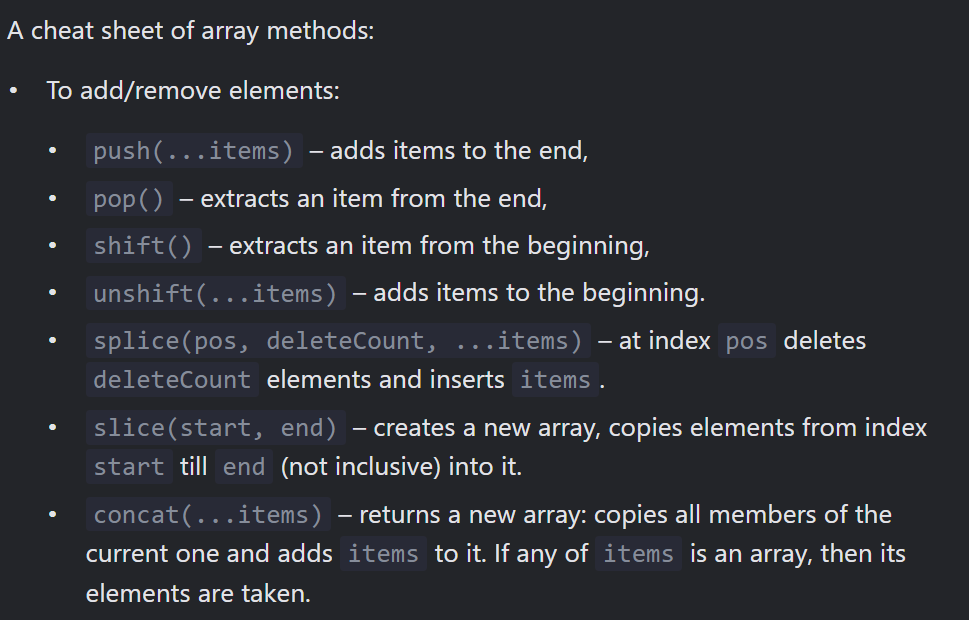
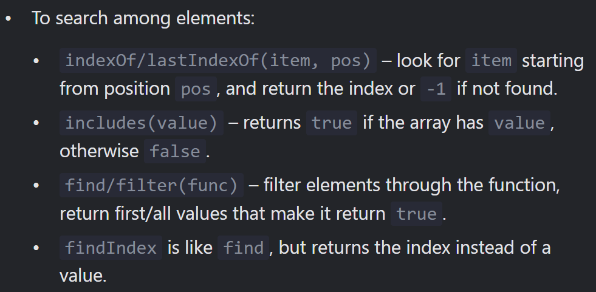
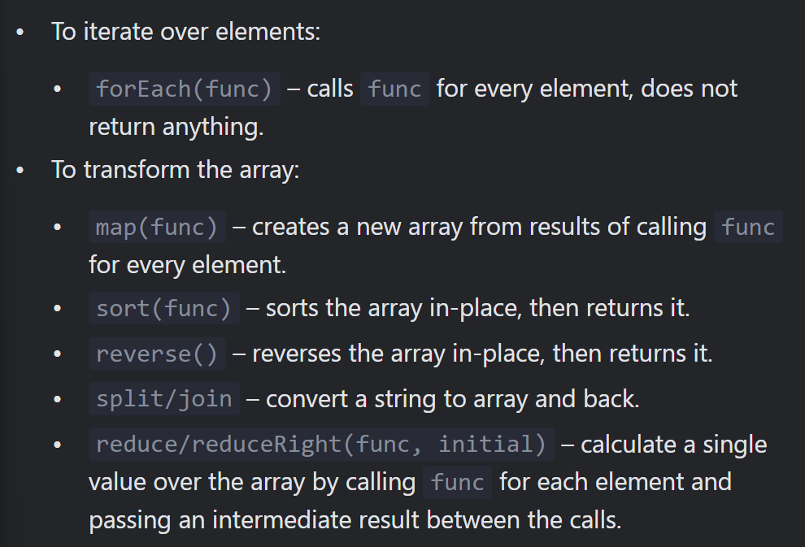

# Array methods

## `Add/remove items `
- arr.push(...items) – adds items to the end,
- arr.pop() – extracts an item from the end,
- arr.shift() – extracts an item from the beginning,
- arr.unshift(...items) – adds items to the beginning.

## `splice - modifies the original array `
```js
let arr = [ "I", "go", "home"];

delete arr[1]; // remove "go""
alert( arr[1]); // undedined
arr.length // 3

// The arr.splice method is a Swiss army knife for arrays. It can do everything: insert, remove and replace elements.

The syntax is:

arr.splice( start, deleteCount, elem1,...,elemN )

let arr = [ a, b, c];
arr.splice(1,1) // from index 1 remove 1 element
console.log(arr); // [a, c]

let arr = ["I", "study", "JavaScript", "right", "now"];

arr.splice(0,3,"Let's", "dance");
console.log( arr ) // now ["Let's", "dance", "right", "now"]

`Negative indexes allowed`
let arr = [1, 2, 5];
// from index -1 (one step from the end )
// delete 0 elements,
// then insert 3 and 4
arr.splice(-1, 0, 3, 4);

console.log( arr ) // 1,2,3,4,5


```
## `slice : Create new copy from array`
```js
arr.slice( [start],[end])

let arr = ["t", "e", "s", "t"];

alert( arr.slice(1, 3) ); // e,s (copy from 1 to 3)

alert( arr.slice(-2)) // s,t ( copy from -2 till the end)

`We can also call it without arguments: arr.slice() creates a copy of arr. ` 
```
## `concat : creates a new array` 
```js
let arr = [1, 2];

// create an array from: arr and [3, 4]
alert(arr.concat([3, 4]) ); // 1, 2, 3, 4, 5, 6


```
## `Iterate: forEach `
```js
arr.forEach(function(item,index,arr){
  // ... do something with an item
});

arr.forEach((item, index, arr) => {
  // ... do something with an item
});

```
## `Searching in array `
### `indexOf/lastIndexOf and includes`
- `arr.indexOf(item, from)` – looks for item starting from index from, and returns the index where it was found, otherwise -1.

- `arr.includes(item, from)` – looks for item starting from index from, returns true if found.
```js
`arr.lastIndexOf `

let fruits = ["Apple", 'Orange', 'Apple']

alert( fruits.indexOf('Apple') );// 0 (first Apple)
alert( fruits.lastIndexOf('Apple') ); // 2 ( last Apple)
```
## `The includes method handles NaN correctly `
```js
const arr = [NaN];
alert( arr.indexOf(NaN) ); // -1 (wrong, should be 0)
alert( arr.includes(NaN) );// true (correct)

```
## `find and findIndex/findLastIndex `
```js
let result = arr.find(function(item, index, array) {
  // if true is returned, item is returned and iteration
  // for falsy scenario returns undefined
})

`If it returns true, the search is stopped, the item is returned. If nothing is found, undefined is returned.`

let users = [
  {id: 1, name: "John"},
  {id: 2, name: "Pete"},
  {id: 3, name: "Mary"}
];

let user = users.find(item => item.id == 1);

alert(user.name); // John
`In real life, arrays of objects are a common thing, so the find method is very useful.`

`The arr.findLastIndex method is like findIndex, but searches from right to left, similar to lastIndexOf.` 

let users = [
  {id: 1, name: "John"},
  {id: 2, name: "Pete"},
  {id: 3, name: "Mary"},
  {id: 4, name: "John"}
];

// Find the index of the first John
alert(users.findIndex(user => user.name == 'John')); // 0

// Find the index of the last John
alert(users.findLastIndex(user => user.name == 'John')); // 3

```
## `filter : returns an array of all matching elements: `
```js
let results = arr.filter(function(item, index, array) {
  // if true item is pushed to results and the iteration continuous 
  // returns empty array it nothing found
})

let users = [
  {id: 1, name: "John"},
  {id: 2, name: "Pete"},
  {id: 3, name: "Mary"}
];

// returns array of the first two users
let someUsers = users.filter(item => item.id < 3);

alert(someUsers.length); // 2

```
# Transform an array
## `map `
### `It calls the function for each element of the array and returns the array of results.`

```js
let result = arr.map(function(item, index, array) {
  // returns the new value instead of item
});
`For instance, here we transform each element into its length:`

let lengths = ["Bilbo", "Gandalf", "Nazgul"].map(item => item.length);
alert(lengths); // 5,7,6


```
## `sort(fn) `
### `The call to arr.sort() sorts the array in place, changing its element order.`
```js
let arr = [1, 2, 14 ];
// the method reorders the content of arr
arr.sort(); 
alert(arr ); // 1, 14, 2
`The items are sorted as strings by default.`

`Literally, all elements are converted to strings for comparisons. For strings, lexicographic ordering is applied and indeed "2" > "15".` 

`The function should compare two arbitrary values and return:`
function compare(a, b) {
  if ( a > b) return 1;
  if ( a == b) return 0;
  if (a < b) return -1;
}

`For instance, to sort as numbers:`

function compareNumeric(a, b) {
  if (a > b) return 1;
  if (a == b) return 0;
  if (a < b) return -1;
}
let arr = [ 1, 3, 2];
arr.sort(conpareNumeric);
alert(arr); // 1,2,3

`an optimized quicksort or Timsort most of the time)`

```
# `A comparison function may return any number `
##  `arr.sort(function(a, b) { return a - b; });`
## `arr.sort( (a, b) => a - b );`

### `Use localeCompare for strings`
```js
let countries = ['Österreich', 'Andorra', 'Vietnam'];

alert( countries.sort( (a, b) => a > b ? 1 : -1) ); // Andorra, Vietnam, Österreich (wrong)

alert( countries.sort( (a, b) => a.localeCompare(b) ) ); // Andorra,Österreich,Vietnam (correct!)
```
## `reverse `
```js
`The method arr.reverse reverses the order of elements in arr.`

let arr = [1, 2, 3, 4, 5];
arr.reverse();

alert( arr ); // 5,4,3,2,1
```
## `split and join `
```js
let names = 'Bilbo, Gandalf, Nazgul';
let arr = names.split(', ');

for (let name of arr) {
  alert(`A message to ${name}.`); // A message to Bilbo ( and other names )
}

`The split method has an optional second numeric argument – a limit on the array length.` 
let arr = '2, 3, 5, 6'.split(', ',3(no. of element))
alert(arr); // [2,3,5] 

`Split into letters` // with an empty ('')
let str = 'test'; 
alert(str.split('')); // t, e, s, t

`The call arr.join(glue) does the reverse to split. It creates a string of arr items joined by glue between them.`

let arr = ['Bilbo', 'Gandalf', 'Nazgul'];

let str = arr.join(';'); // glue the array into a string using ;

alert( str ); // Bilbo;Gandalf;Nazgul

```
## `reduce/reduceRight `
### `They are used to calculate a single value based on the array.`

`The syntax is:`
```js
let value = arr.reduce(function(accumulator, item, index, array) {
  // ...
}, [initial]);

let arr = [1, 2, 3, 4, 5];

let result = arr.reduce((sum, current) => sum + current, 0);

alert(result); // 15

```
## `Array.isArray `
### `Arrays do not form a separate language type. They are based on objects.`

```js
alert(typeof {}); // object
alert(typeof []); // object (same)

alert(Array.isArray({})); // false

alert(Array.isArray([])); // true
```
## `Most methods support “thisArg” `
```js
arr.find(func, thisArg);
arr.filter(func, thisArg);
arr.map(func, thisArg);
// ...
// thisArg is the optional last argument
`Almost all array methods that call functions – like find, filter, map, with a notable exception of sort, accept an optional additional parameter thisArg.`

`The value of thisArg parameter becomes this for func.`

let army = {
  minAge: 18,
  maxAge: 27,
  canJoin(user) {
    return user.age >= this.minAge && user.age < this.maxAge;
  }

  let users = [
    {age: 16},
    {age: 20},
    {age: 23},
    {age: 30},
  ];
  // find users, for who army.canJoin return true
  let soldiers = users.filter(army.canJoin,army);

  alert(soldiers.length); // 2
  alert(soldiers[0].age); // 20
  alert(soldiers[1].age); // 23
};

```
### If in the example above we used `users.filter(army.canJoin)`, then `army.canJoin` would be called as a standalone function, with `this=undefined`, thus leading to an instant error. `
### A call to `users.filter(army.canJoin, army)` can be replaced with `users.filter(user => army.canJoin(user))` , that does the same. The latter is used more often, as it’s a bit easier to understand for most people.

# ` Summary`


 
